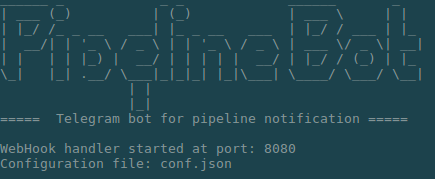

Simple Telegram bot writen in Golang to handle Webhooks from Bitbucket pipelines. 

### Features
  - Instant notification about pipeline start and it's result 

### Installation
Compiling project requirs _Golang 1.6_.

Install the dependencies first:

```sh
cd pipeline-bot
go get
```

Run your bot (example):
```sh
go run -port=2000 -conf=bot.conf
```

### Configuration
Before starting the bot you have to receive Telegrm bot key from [BotFather](https://core.telegram.org/bots). Then just include this key to configuration file:
**bot.conf**
~~~json
{
  "auth_token": "my_telegram_bot_key"
}
~~~

**By default**, bot runs at port 8080 and searches for conf.json file.

PS: all images in __resource__ folder are found via image search, I don't own it and I won't use it for any commercial purpose.

